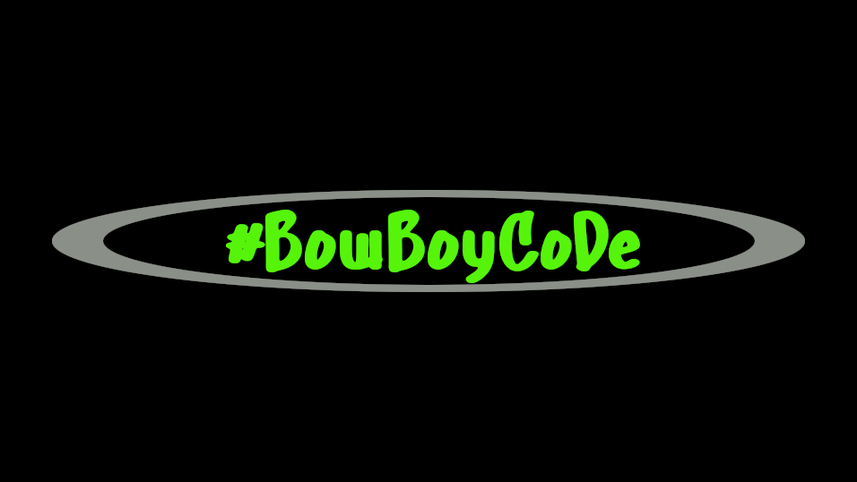

*******
<div align="center">

## Welcome to BowBoyCoDeRepo

</div>

*******

<div align="center">


*******

# BowBoyGit/BowBoyCoDeRepo


*******

:snake: :snake: :snake: :snake: :snake: :snake: :snake: :snake: :snake: :snake: :snake: :snake: :snake: :snake: :snake:


## Thank You to all the ***OpenSource Developers*** :<br>


[Github](https://www.github.com/)<br>
[Linux](https://www.linux.org/)<br>
[Python](https://www.python.org/)<br>
[Django](https://www.djangoproject.com/)<br>


<!-- ```python

print('hello world')

``` -->


*******

https://github.com/BowBoyGit/BowBoyCoDeRepo</div>


<!-- [GitHub](http://github.com) -->
<!-- 
 -->
<!-- As Grace Hopper said:
> I’ve always been more interested
> in the future than in the past. -->

<!-- ### 01 - The Basics -->


