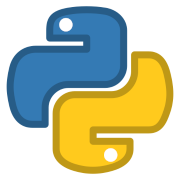

# Welcome to BowBoyGit/BowBoyCoDeRepo
*******


#### BowBoyGit/BowBoyCoDeRepo
<div align="center">Hello,<br/>
My name is BowBoy<br/>
I will be pushing my ***Python3*** coding examples here.
:snake: :snake: :snake: :snake: :snake: :snake: :snake: :snake: :snake: :snake: :snake: :snake: :snake: :snake: :snake:</div>

<div align="center">The derogatory term “scrub” means several different things. One definition is someone (especially a game player) who is not good at something (especially a game). By this definition, we all start out as scrubs, and there is certainly no shame in that. I mean the term differently, though. A scrub is a player who is handicapped by self-imposed rules that the game knows nothing about. A scrub does not play to win.</div>

##### refusing to bow to the inevitable
— John O'Hara
*******

##### I'm currently learning:
* Python
* Django
*******

Python3
```python

print('hello world')

```
*******

https://github.com/BowBoyGit/BowBoyCoDeRepo


<!-- [GitHub](http://github.com) -->
<!-- 
 -->
<!-- As Grace Hopper said:
> I’ve always been more interested
> in the future than in the past. -->

<!-- ### 01 - The Basics -->


